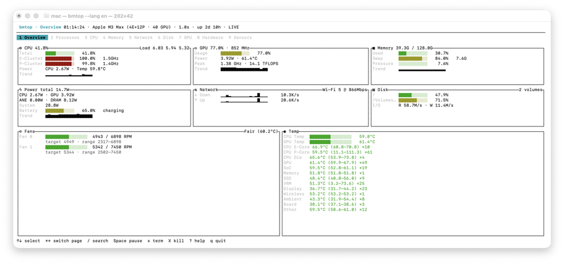
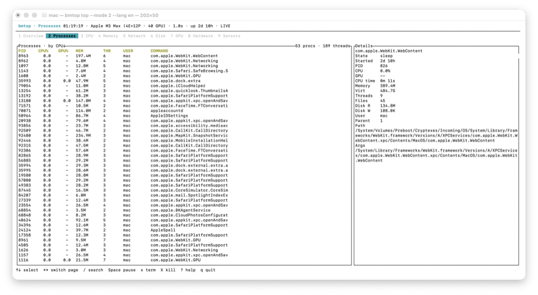
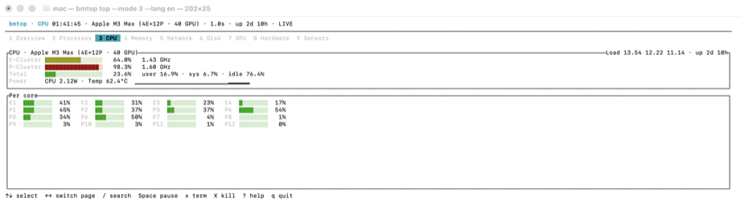
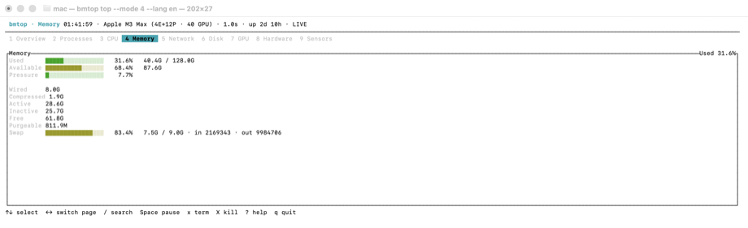
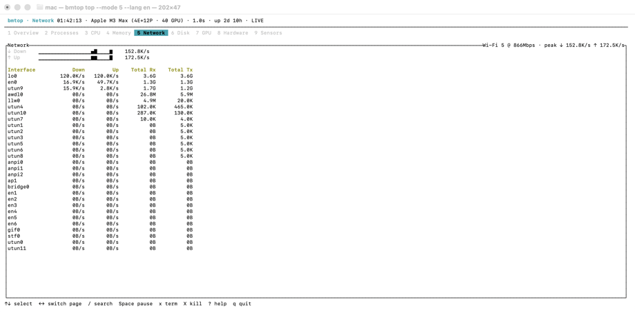
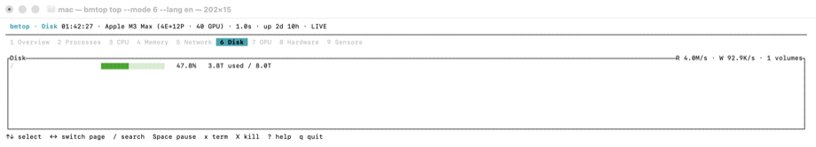
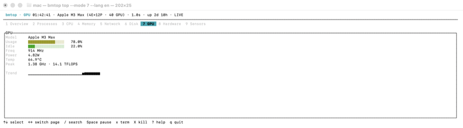
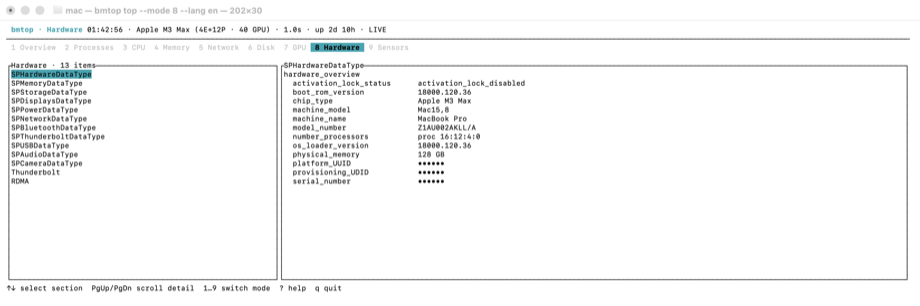
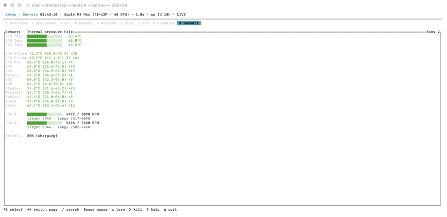

<h1 align="center">bmtop</h1>

<p align="center">
  <b>A local-first terminal monitor for macOS.</b><br/>
  htop-style process control plus native Apple Silicon SoC telemetry — power, frequency,
  temperature, fans — with no sudo and no daemons.
</p>

<p align="center">
  <a href="https://github.com/BetterMacNet/bmtop/actions/workflows/ci.yml"></a>
  <a href="https://github.com/BetterMacNet/bmtop/releases/latest"></a>
  <a href="LICENSE"></a>
  
  
</p>

<p align="center">
  
</p>

## Highlights

- **Native SoC telemetry on Apple Silicon** — E/P cluster frequency and residency,
  CPU/GPU/ANE/DRAM power, system wall power, temperatures, fans and thermal
  pressure, read directly via IOReport/SMC. No `sudo`, no `powermetrics` daemon.
- **Per-process energy** — Activity Monitor's Energy Impact, computed from the
  same `/usr/share/pmenergy` coefficients Apple ships, plus an estimated
  per-process wattage derived from the measured CPU/GPU package power. Both
  columns are sortable; the overview summarises the top consumers.
- **Everything in one dashboard** — processes, CPU, memory, network, disk I/O,
  GPU (including per-process usage and peak frequency with theoretical TFLOPS),
  battery, hardware and sensors.
- **Deep hardware awareness** — network link type (Ethernet speed / Wi-Fi
  generation), Thunderbolt topology, RDMA status, and opt-in display FPS.
- **Scripting-grade output** — every panel is also a subcommand with stable
  `json` / `jsonl` / `csv` output, versioned schema and sysexits-style exit codes.
- **Local-first and privacy-conscious** — no telemetry, no network calls;
  hardware identifiers are redacted in JSON by default.
- **top/htop muscle memory** — sorting, filtering, tree view and kill flows
  follow macOS `top` and procps `top` conventions.

<p align="center">
  
</p>

## Install

### Homebrew

```sh
brew install bettermacnet/tap/bmtop
```

### Prebuilt binary

Each release ships a universal binary (arm64 + x86_64):

```sh
curl -sLO https://github.com/BetterMacNet/bmtop/releases/latest/download/bmtop-macos-universal.tar.gz
tar -xzf bmtop-macos-universal.tar.gz
./bmtop
```

Verify the download against the `.sha256` file published next to the asset.

### From source

```sh
git clone https://github.com/BetterMacNet/bmtop.git
cd bmtop
cargo install --path crates/bmtop
```

## Usage

Run `bmtop` to open the interactive TUI. In a pipeline, use an explicit
subcommand and a machine-readable format:

```sh
bmtop top                                  # one-shot table snapshot
bmtop ps --sort memory --limit 10          # top memory consumers
bmtop ps --sort energy --limit 10          # what is draining the battery
bmtop memory --format json                 # single JSON snapshot
bmtop network -n 60 -i 1s --format jsonl   # 60 samples, then exit
bmtop gpu --enhanced                       # one sudo powermetrics sample merged in
bmtop doctor --format json                 # capability probe report
```

JSON output follows `schema_version` 2: `captured_at` is UTC RFC 3339 and
`capabilities` lists what the producing snapshot could observe. `-n/--count N`
samples N times and exits; `--watch` runs until Ctrl-C. Exit codes are
sysexits-style: `64` usage, `69` capability unavailable, `77` permission
denied, `70` other failures.

Shell completions for bash, zsh and fish are installed by Homebrew, or can be
generated with `bmtop completion <shell>`.

## Keybindings

### Navigation

| Key | Action |
|-----|--------|
| `1`–`9` / `F1`–`F9` | Jump to a mode |
| `←` `→` / `Tab` `Shift+Tab` | Cycle through the mode bar |
| `↑` `↓` | Move selection |
| `/` | Search |
| `Space` | Pause |
| `?` | Help |
| `q` | Quit |

When the terminal supports the enhanced keyboard protocol (kitty, WezTerm,
Ghostty, …) bmtop enables it on startup, so `Command+1`–`Command+9` also
switch modes; `bmtop doctor` reports the detection result as
`keyboard.command_digit`.

### Sorting and filtering (macOS `top` conventions)

| Key | Action |
|-----|--------|
| `o` / `O` | Cycle sort column (CPU/GPU/NRG/PWR/MEM/PID) / reverse order |
| `s` | Prompt for sampling interval (`2` = seconds, `500ms` works too) |
| `u` | Filter by user (blank or `Esc` shows all) |

### procps `top` conventions

| Key | Action |
|-----|--------|
| `P` / `M` / `N` | Sort by CPU / memory / PID |
| `E` / `W` | Sort by energy impact / estimated watts |
| `R` | Reverse sort order |
| `d` | Alias for `s` |
| `c` | Toggle full command paths |
| `i` | Hide idle processes |
| `V` | Tree view indented by parent PID |
| `H` | Thread list for the selected process |
| `+` / `-` | Step interval by 250ms |
| `Ctrl+L` | Force full redraw |

The cursor is pinned to the process under it, not the row number, so
re-sorting between samples never moves your selection.

### Process actions

| Key | Action |
|-----|--------|
| `x` / `k` | Terminate the selected process (SIGTERM, with confirmation) |
| `X` | Force-kill the selected process (SIGKILL, with confirmation) |
| `f` | Toggle display FPS (requires Screen Recording permission) |

Termination always requires confirmation and revalidates PID plus process
start time. PID 0, PID 1 and the bmtop process itself are protected.

## Pages

**CPU** — E/P cluster frequency and residency, per-core load:

<p align="center"></p>

**Memory** — usage, pressure, wired/compressed/active breakdown and swap:

<p align="center"></p>

**Network** — live throughput, link type and per-interface totals:

<p align="center"></p>

**Disk** — per-volume usage (decimal units, as vendors label them) and system-wide I/O:

<p align="center"></p>

**GPU** — usage, frequency, power, temperature and peak TFLOPS:

<p align="center"></p>

**Hardware** — system_profiler sections plus Thunderbolt and RDMA (identifiers redacted):

<p align="center"></p>

**Sensors** — thermal pressure, every temperature group, fans and battery:

<p align="center"></p>

## Permissions and privacy

Normal collection needs **no administrator access**. SoC metrics come from the
private IOReport library, read-only SMC keys and `notify_get_state` — all
readable without root. On Intel Macs, or when IOReport is unavailable, `soc`
data is omitted and the UI degrades gracefully; `bmtop doctor` reports the
probe result under `soc`.

`bmtop gpu --enhanced` and `bmtop sensors --enhanced` run one `powermetrics`
sample through `/usr/bin/sudo` (fixed binary, fixed arguments, no shell) and
merge GPU frequency/power and thermal pressure into the output; `--enhanced`
is rejected elsewhere. Signals for another user's process also go through
`sudo` only when explicitly requested. The TUI never runs as root and
passwords are never stored.

Energy Impact uses the `energy_constants` in `/usr/share/pmenergy/default.plist`
(CPU time weighted per QoS class, wakeups, disk I/O) fed by `proc_pid_rusage` —
no root, no `powermetrics`. Two deliberate deviations from Activity Monitor:
per-process network packets are excluded (no unprivileged interface for them),
and where `ri_pkg_idle_wkups` stays flat — as it does on Apple Silicon — the
wakeup term falls back to `ri_interrupt_wkups`. Estimated watts splits the
measured CPU/GPU package power across processes by CPU/GPU share, so the column
sums to the overview power card; it is an attribution model, not a measurement,
and it is absent when SoC data is unavailable.

Hardware identifiers are redacted in JSON by default; use `--show-sensitive`
only when the local output is trusted. DRAM/ANE bandwidth rows appear where
the kernel exposes AMC byte counters (some macOS 26 builds reject that
IOReport group; the rows hide there).

## Development

```sh
./scripts/verify.sh            # fmt, clippy -D warnings, all tests, doctor smoke check
./scripts/build-universal.sh   # arm64 + x86_64 slices combined with lipo
./scripts/package-release.sh   # universal binary + tar.gz + sha256 in dist/
```

### Cutting a release

1. Bump `version` in `Cargo.toml`, run `cargo update -p bmtop -p bmtop-core -p bmtop-macos -p bmtop-tui`, commit as `chore: release vX.Y.Z`.
2. Push `main`, wait for CI.
3. Push a matching `vX.Y.Z` tag.

The tag drives `.github/workflows/release.yml`, which validates the tag
against the workspace version, builds the universal binary, publishes the
GitHub release, and then bumps the `bmtop.rb` formula in
[BetterMacNet/homebrew-tap](https://github.com/BetterMacNet/homebrew-tap) to
the new source tarball and its sha256. Tags carrying a prerelease suffix
(`v1.2.3-rc1`) skip the formula bump.

The formula bump needs a `HOMEBREW_TAP_TOKEN` repository secret — a
fine-grained PAT scoped to the tap repository with **Contents: read and
write**. `github.token` cannot reach another repository. Without the secret
that job fails and the GitHub release still succeeds, so a release is never
left half-published; re-run the job after adding it.

It runs `./scripts/bump-homebrew-formula.sh`, which is also usable by hand if
CI is unavailable — it is idempotent, so re-running a release is safe:

```sh
DRY_RUN=1 ./scripts/bump-homebrew-formula.sh v0.2.0   # print the diff only
GH_TOKEN=… ./scripts/bump-homebrew-formula.sh v0.2.0  # commit and push the bump
```

The workspace is split into `bmtop-core` (models, schema, i18n),
`bmtop-macos` (native collectors), `bmtop-tui` (ratatui UI) and `bmtop`
(CLI).

## License

[MIT](LICENSE) © 2026 BetterMacNet

Bundled third-party crates are listed with their licenses in
[THIRD-PARTY-NOTICES.md](THIRD-PARTY-NOTICES.md). SoC metrics are read
through Apple system libraries (IOReport, IOKit/SMC), which ship with macOS
and are not redistributed.
